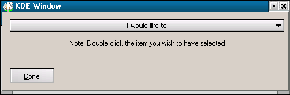



## Easy KDE Custom Form Controls

### Description

Ok, this zip includes KCombo, KdeButton, four custom form conrols, you align them to the sides, and its as if thats the actual window. You can resize the forms, as long as you align the the sides right... You can set an icon, you can double click the drag bar and it will become smaller, also you can click the icon for a menu for resizing, minimizing, and closing... This one has a gradient drag bar, I tried to do the dot thing like in KDE but for some reason they dont show up, maybe you know why :( ... Please rate this, by the way, I dont know if the Kcombo.ctl is in there, so if it isnt, just leave a comment about it, and ill submit the source for it to PSC... Thanks, Dr. Fire :) OH YEA, you can also make resizing disabled ;)
 
### More Info
 

             |
---                |---
**Submitted On**   |2003-08-26 02:21:36
**By**             |[Jesse Seidel \(Dr\. Fire\)](https://github.com/Planet-Source-Code/PSCIndex/blob/master/ByAuthor/jesse-seidel-dr-fire.md)
**Level**          |Intermediate
**User Rating**    |4.9 (34 globes from 7 users)
**Compatibility**  |VB 6\.0
**Category**       |[Custom Controls/ Forms/  Menus](https://github.com/Planet-Source-Code/PSCIndex/blob/master/ByCategory/custom-controls-forms-menus__1-4.md)
**World**          |[Visual Basic](https://github.com/Planet-Source-Code/PSCIndex/blob/master/ByWorld/visual-basic.md)
**Archive File**   |[Easy\_KDE\_C1635928262003\.zip](https://github.com/Planet-Source-Code/jesse-seidel-dr-fire-easy-kde-custom-form-controls__1-48015/archive/master.zip)

